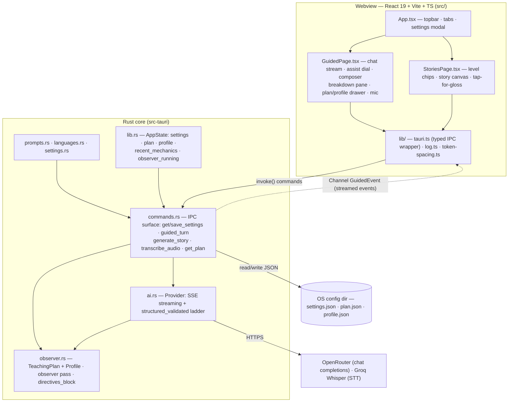
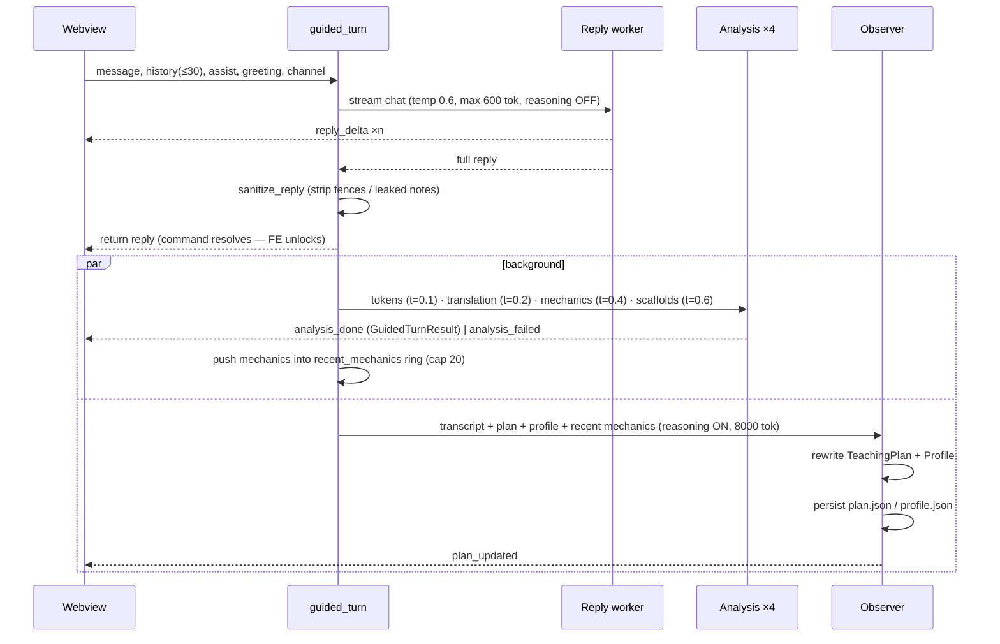

# Architecture

Glossa is a **Tauri v2** app: a React 19 + Vite + TypeScript webview frontend
(`src/`) driving a Rust core (`src-tauri/`). The Rust core owns **everything
sensitive and durable**: API keys, settings, the observer documents, and all
LLM/STT network calls. The frontend is pure UI + state over a small IPC
surface.



## Module map (with sizes)

| File | Lines | Role |
|---|---|---|
| `src-tauri/src/commands.rs` | 663 | The whole v0.1 IPC surface; guided turn orchestration |
| `src-tauri/src/ai.rs` | 378 | OpenAI-compatible client: streaming, schema-constrained structured output, fallback ladder, `$defs` inlining |
| `src-tauri/src/observer.rs` | 278 | TeachingPlan/Profile documents, observer pass, `directives_block` |
| `src-tauri/src/prompts.rs` | 216 | Prompt builders composed from shared blocks |
| `src-tauri/src/languages.rs` | 78 | Language lists + per-variant overlays |
| `src-tauri/src/settings.rs` | 67 | Settings model + JSON persistence |
| `src-tauri/src/lib.rs` | 80 | Bootstrap, `AppState`, command registration, logging |
| `src/pages/GuidedPage.tsx` | 744 | The main surface |
| `src/pages/StoriesPage.tsx` | 174 | Story reader |
| `src/components/SettingsModal.tsx` | 180 | Settings UI |
| `src/types.ts` | 102 | TS mirror of the Rust wire types |
| `src/lib/*` | ~130 | invoke wrapper + log bridge + token spacing |

## IPC surface (complete, v0.1)

Six commands, registered in `lib.rs::run()`:

| Command | Direction | Payload | Notes |
|---|---|---|---|
| `get_settings` | FE ← BE | → `Settings` | Returns the full settings object, **including key material** (see Status, R12) |
| `save_settings` | FE → BE | `Settings` | Persists to `settings.json`, updates in-memory state |
| `guided_turn` | FE → BE | `message, history, assist_level, greeting, on_event: Channel<GuidedEvent>` | Returns the reply string once pass 1 finishes; analysis + observer arrive via the channel |
| `generate_story` | FE ← BE | `level` → `StoryResponse` | One structured call |
| `transcribe_audio` | FE ← BE | `audio_base64` → text | Groq `whisper-large-v3-turbo`, webm assumed |
| `get_plan` | FE ← BE | → `{plan, profile}` | For the Plan drawer / initial load |

### `GuidedEvent` (channel protocol, snake_case tagged)

| Event | When | Effect in UI |
|---|---|---|
| `reply_delta` | Pass 1 token | Appends to pending bubble |
| `reply_done` | Pass 1 complete | Composer unlocks; turn becomes "analyzing…"; auto-pin breakdown |
| `analysis_done` | Pass 2 complete | Replaces turn with full `GuidedTurnResult` |
| `analysis_failed` | Pass 2 dead | Marks turn reply-only, clears stale scaffolds |
| `plan_updated` | Observer pass complete | Updates Plan drawer + focus chips |

## The guided turn pipeline

This is the heart of the app (`commands.rs::guided_turn`):



Key properties:

- **The learner keeps typing while analysis lands.** The command resolves at
  `ReplyDone`; pass 2 and the observer run in `tokio::spawn`ed tasks.
- **The observer never overlaps itself.** An `observer_running` mutex flag
  skips a pass if the previous one is still thinking; the next turn picks it
  up. The plan is never more than one turn stale.
- **Per-section degradation.** The four analysis sub-calls fail independently;
  a failed section costs only that section (empty tokens, no mechanics, etc.).
- **Anti-repetition.** `recent_mechanics` (ring buffer, last 20 card titles)
  plus the observer's `taught_ledger` are rendered into an "ALREADY TAUGHT —
  do NOT re-teach" block injected into the reply, mechanics, and scaffolds
  prompts via `observer::directives_block`.

## The three agent roles

| Role | Model default | Reasoning | Temp | max_tokens | Output |
|---|---|---|---|---|---|
| Reply worker | `deepseek/deepseek-v4-flash-0731` (worker default) | disabled (fallback: retry without the parameter for mandatory-reasoning models) | 0.6 | 600 | plain text, streamed |
| Analysis workers ×4 | same worker model | disabled | 0.1–0.6 | 3000 | schema-constrained JSON |
| Observer | `z-ai/glm-5.3-flash` | **enabled** (the whole point) | 0.4 | 8000 | schema-constrained JSON |

Defaults live in `settings.rs` (`default_model`, `default_observer_model`);
the worker model is editable in Settings; the observer model is currently
only editable by hand-editing `settings.json`.

### Prompt composition

`prompts.rs` builds every prompt from shared blocks so the rules have one
source of truth:

- `persona_block` — role, target language, CEFR, native language.
- `mandatory_rules` — scope lock (language practice only), content policy,
  persona lock. "These override everything else."
- `always_respond_rule` — always reply in the target language.
- `no_emoji_rule` — TTS-forward: no pictographs ever.
- Language `overlay()` — per-variant guidance (e.g. Peninsular Spanish +
  vosotros, European Portuguese clitic placement, simplified characters +
  pinyin-as-support for zh-CN).
- `directives_block` — the observer's advisory plan (focus, recast queue with
  budget, vocab recycle, avoid-list, interests, energy read, taught ledger).

Per-surface builders: `guided_reply_prompt`, `guided_tokens_prompt`,
`guided_translation_prompt`, `guided_mechanics_prompt`,
`guided_scaffolds_prompt`, `story_prompt` (+ `LEVEL_BANDS` for word-count and
grammar bands, `resolve_cefr` mapping beginner/intermediate/advanced → A2/B1/C1).

## Structured output: the fallback ladder

`ai.rs::structured_validated` (learned the hard way in FreeLingo):

1. **Attempt 0** — native `response_format: json_schema` (constrained
   decoding where supported). Schemas are generated with `schemars` from the
   Rust types and **fully `$defs`-inlined first** (`inline_defs`), because
   several gateways mishandle `$ref` and silently drop nested keys.
2. **Fallback** — if the provider rejects the schema (request-level failure),
   retry with prompted JSON (the schema is dropped; the system prompt already
   says what to produce).
3. **Corrective retry** — on parse failure or `validate()` rejection, the raw
   response plus a "Validation error: … return the COMPLETE corrected JSON"
   user message are appended and the model gets one more shot (up to 3
   attempts total).
4. `extract_json` grabs the outermost `{…}` regardless of prose/fences.

Streaming has its own fallbacks: a 429 backs off 3s and retries once; a
request that fails with the `reasoning: {"enabled": false}` parameter is
retried without it (bumping max_tokens to 1200).

## Persistence

| Data | Where | Written by |
|---|---|---|
| `settings.json` (keys, models, languages, mic) | `app_config_dir` (falls back to `%TEMP%/glossa`) | `save_settings` |
| `plan.json` (TeachingPlan) | `app_config_dir` | observer pass, every success |
| `profile.json` (Profile) | `app_config_dir` | observer pass, every success |
| Assist level | `localStorage.glossa_assist` | UI |
| Target language mirror | `localStorage.glossa_target` | App on load/save |
| Cached story | `localStorage.glossa_story_<lang>_<level>` | StoriesPage |

**Conversation history lives only in memory** — the chat resets on restart
(the plan/profile carry continuity). `AppState` also has a `learner_turns`
counter that is currently unused.

## Frontend state model

`GuidedPage` keeps an array of `Turn`:

```ts
interface Turn {
  id: number
  user: string | null            // null for the greeting turn
  assistant: GuidedTurnResult | null
  pendingText: string            // streaming buffer before assistant exists
  analysisState: 'pending' | 'done' | 'failed' | null
}
```

- History sent upstream = last 30 `(role, content)` pairs from completed turns.
- The breakdown pane is pinned to the newest completed turn by default; tapping
  a bubble re-pins it (`pinnedId`).
- Scaffolds come from the **latest** analyzed turn (never an older one — a
  failed analysis clears them).
- Mic: `MediaRecorder` → webm → base64 → `transcribe_audio`; auto-stop at 10s;
  transcript appended to the composer input (never auto-sent).

## Build & run (developer view)

```
npm install
npm run tauri dev      # vite on :1420 (strict) + cargo dev build
npm run tauri build    # release bundle (NSIS + portable on Windows)
npm run build          # tsc + vite build (frontend only)
```

Release profile: `strip = true`, `lto = true`. Window 1200×800 (min
900×620), dark background `#0c1420`. Capabilities: `core:default`,
`log:default` only. Logging: stdout + log-dir file (2 MB, keep-one rotation)
+ webview console bridge, Debug level.
