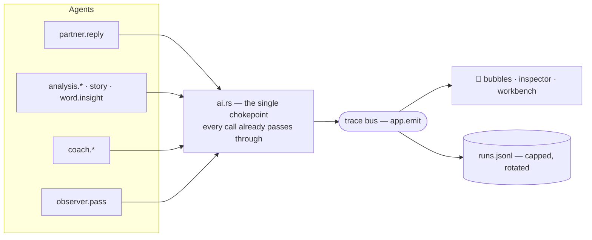

# Observability — the app explaining itself

Status: **bites 1 + 1.5 SHIPPED** (2026-09-01) — the ontology, the turn plan,
the *generated* graph, the `Run` record, the trace bus, reconciliation, and
the Graph / Runs views in three shells. Bites 2–5 are specified below and not
started.

## Why this exists (three reasons, all real)

1. **Practical, and currently blocking.** A single guided turn fires **eight
   model calls** across three roles with different models, temperatures and
   reasoning settings. What exists to explain that today is a log file and
   four session-scoped atomic counters. The app has outgrown the developer's
   ability to interrogate it, which makes this a bottleneck to every other
   feature on the roadmap.
2. **Pedagogical.** Glossa teaches a language. It should *also* — quietly,
   optionally, never in the way — teach how the thing teaching you actually
   works. An LLM app that shows its own prompts, plans and decisions is a
   better AI-literacy artifact than any explainer written about it, because
   it cannot drift from the truth: it *is* the truth, rendered.
3. **A designed answer to the paradox of the active user.** People plateau on
   tools; they stop at the first configuration that works and never learn
   what else is there. The counter-move is not a tutorial and not a settings
   toggle — it is to make the next layer down **permanently visible and one
   click away**, at every depth, so that curiosity is always rewarded and
   never required.

The unifying claim: **the developer view and the learner view are the same
records at different depths of vocabulary.** Build one substrate, render it
three ways. Anything else drifts.

## The agent ontology

The agent model is **not** a parallel structure bolted onto the software
ontology — it is part of it. A user who explores the agents is already
exploring the architecture; that is the whole point.

### The standard: OpenAI Agents SDK

An Agent is *an LLM configured with `instructions`, `tools`, and optionally
`handoffs`, `guardrails`, `output_type`, `sessions`*. The operative test:
**instructions plus tools it can invoke.** A prompt with no tools is a model
call, not an agent.

Measured against that, Glossa is a **workflow with two agents**. Being honest
about this is the point — a tool that teaches "every LLM call is an agent"
teaches the industry's sloppiest habit, and this vocabulary is curriculum.

| | Instructions | Session / memory | Tools | Handoffs |
|---|---|---|---|---|
| **Chat** | `guided_reply_prompt` | conversation history | — | — |
| **Coach** | `coach_system_prompt` | `coach_thread.json`, `plan.json`, `profile.json` | — | — |
| the 9 tools | ✅ | — | — | — |

Neither agent has tools or handoffs *yet*, so both are strictly "agent-shaped"
under the SDK definition. What would make them agents proper: letting the Chat
agent decide to invoke `word_insight` or `speak` on its own, and letting the
Coach hand off to the Chat agent. That is a later bite — the **names** get
honest first.

### The three categories

| Category | Test | Members |
|---|---|---|
| **Agent** | instructions + memory that outlives the call | Chat, Coach |
| **Tool** | one transformation, no memory, no choice | tokenize, translate, tokenize_learner, explain, suggest, word_insight, story |
| **Faculty** | perception or action — a capacity an agent *has* | transcribe (ears), synthesize (voice) |

The orchestrator (`commands.rs::guided_turn`) is a **Runner**: deterministic
Rust that walks the graph. It is not an agent and is not called one.

`Operation.mechanical` marks the four operations a dictionary lookup will
replace ([Future Work](./future-work)). **That flag is the proof of the
distinction** — something a hash map can stand in for was never an agent.

### The registry

Implemented in `src-tauri/src/ontology.rs`. Call sites use `ontology::op::*`
constants, never string literals. Five unit tests hold the line: op constants
resolve, ids are unique, the agent↔operation relation agrees in both
directions, no faculty is ever attributed to an agent, and `Actor`'s wire
shape matches the TypeScript union exactly.

| Operation | Actor | Notes |
|---|---|---|
| `reply` | Chat | streamed |
| `review` | Coach | per-message feedback; skipped on greeting |
| `answer` | Coach | the private thread |
| `reflect` | Coach | **reasoning on**; rewrites plan + profile (was "the observer") |
| `tokenize` · `translate` · `tokenize_learner` · `word_insight` | Runner | `mechanical` |
| `explain` · `suggest` · `story` | Runner | generative long tail |
| `transcribe` · `synthesize` | Runner | faculties: perception / action |

## Fidelity — the philosophy this page is really about

Observability is a double-edged tool. It is the most valuable thing you can
build for a system this complex — *and* if it has any squishiness, it becomes
a second body of complexity to maintain independently of the code, which
adds murk instead of removing it. The more tightly the view is coupled to
the code, the more the view can be trusted.

So the governing rule: **observability artifacts must be derived, not
maintained.** Anything maintained independently is a *claim*, and claims rot.
For every element of the picture, ask: what makes it impossible for this to
be wrong?

Three strengths, in increasing order. Every part of the graph layer is
labelled with which one it has:

| Tier | Guarantee | Used for |
|---|---|---|
| **Derived** | One artifact. Execution and view read the same structure; cannot drift by construction. | Nodes, edges, hydration — generated from `turn_plan.rs` |
| **Reconciled** | Runtime observation is diffed against the declaration and disagreement is surfaced. Can still be wrong, but it *says so*. | Dependency edges, via `trace::reconcile` |
| **Attested** | A human wrote it; only internal consistency is checked. | Node positions, prose |

The line we draw: **structure derived, position authored.** Layout is
aesthetic, and layout being wrong is visible and harmless — tune it by hand
freely. Anything load-bearing must be derived or reconciled.

### The worked example (why this page exists)

The first version of this graph was hand-keyed: written by reading
`commands.rs` and transcribing what was there. It had tests — every operation
has a node, every edge connects declared nodes, every node hydrates — and all
of them passed, because they checked the graph against *itself*.

It was still wrong. It drew `tokenize_learner` as fanning out from `reply`.
That call reads **only the learner's own message**; it never had a data
dependency on the reply at all. The edge was a scheduling accident promoted
to an architectural claim. Two consequences:

1. The picture asserted a dependency that did not exist, and nothing could
   catch it.
2. It **hid a real win** — the call could start the moment you hit send,
   roughly 700ms earlier than it did.

Both are now fixed, and the fix is structural: the plan says
`needs: [LearnerMessage]`, the Runner starts it early because of that, the
graph draws it from the input node because of that, and reconciliation
contradicts the edge if it ever regresses.

## The graph, declared

Graph-engineering vocabulary: **nodes** (agent steps, tools, faculties,
barriers), **edges** (routing), and the **shared state** flowing along them.

### `turn_plan.rs` — the single source

`src-tauri/src/turn_plan.rs` declares what a turn does: which operations
fire, what each **actually depends on**, and whether it hydrates the screen.

```rust
Step {
    op: op::TOKENIZE_LEARNER,
    needs: &[Input::LearnerMessage],   // NOT the reply
    hydrates: true,
    joins: true,
    background: false,
    condition: None,
}
```

`graph::turn_graph()` is **generated** from that table — nodes from the
steps, edges from each step's `needs`. Nothing transcribes `commands.rs`.
Change the plan and the picture changes with it; that is the whole point.

Only the x/y positions are authored, in one `position()` match arm.

### Hydration is not a barrier

```
your message ─┬──────────────► reply ──stream──► your screen
              │                  │
              │                  ├─► tokenize ──────► your screen
              │                  ├─► translate ─────► your screen
              │                  ├─► explain ───────► your screen
              │                  ├─► suggest ───────► your screen
              │                  ├─?► review ───────► your screen
              │                  └─bg?► reflect ────► your screen
              │                       │
              └─► tokenize (yours) ───┤──► your screen
                                 fan-in ▼  reconcile only — NEVER a gate
                                  analysis_done
```

Every working node has its **own** `Hydrate` edge: each section appears the
moment it lands, and a slow `explain` can never hold up a fast `translate`.
The fan-in only publishes the authoritative merged state. A spinner that
blocks the pane until the slowest sibling returns is precisely the failure
this design prevents.

Two tests enforce it — every step must hydrate, and nothing may reach the
screen *only* through the barrier — so encoding the fan-in as a gate fails
the build.

## Reconciliation — the picture reporting on itself

`trace::reconcile()` diffs the declared graph against the runs actually
recorded, and the verdict is rendered as a banner under the graph:

> ✓ consistent with 1 observed turn · 6 declared but not yet exercised

It computes three things:

| Finding | Meaning |
|---|---|
| **undeclared operation** | It ran, but no node declares it. The map is missing something. |
| **unobserved operation** | Declared, never seen to run this session. Unproven, not wrong. |
| **contradicted edge** | The dependent *started before its dependency finished* — so the edge cannot be real. Drawn in red on the canvas, labelled `✕ contradicted`. |

The contradiction test is what makes this more than decoration: it is
falsifiable from timing data alone, and it would have caught the
`reply → tokenize_learner` edge on the very first turn.

**This is the autogogical lesson in miniature: never trust a diagram that
cannot tell you when it is wrong.**

## The Run — the unit of observability

One execution of one agent. This is a **first-class domain entity**, and it
belongs in [Ontology](./ontology) alongside Turn, TeachingPlan and Profile.
Implemented in `src-tauri/src/trace.rs`, mirrored in `src/types.ts`. The
`prompt`, `input` and `output` fields below are bite 2 — everything else ships.

| Field | Semantics |
|---|---|
| `id` | Unique per run |
| `turn_id` | Lineage — which turn this belongs to. `None` for out-of-turn runs (story, word insight) |
| `operation` | Operation id from the registry above |
| `actor` | `{type:'agent',id:'chat'\|'coach'}` or `{type:'runner'}` |
| `model` · `temperature` · `reasoning` · `max_tokens` | The request profile, recorded as sent |
| `prompt` | `PromptRecord` — **the composed blocks, not just the string** (see below) |
| `input` | What this run was given (message, history depth, pinned turn, …) |
| `output` | Raw response text, plus the parsed value for structured calls |
| `schema` | Schema name + the inlined schema, for structured calls |
| `timing` | `started` · `first_token` · `finished` |
| `usage` | `prompt_tokens` · `completion_tokens` · `cost` |
| `attempts` | Per-attempt record: what happened on that attempt, and the actual error verbatim |
| `outcome` | `ok` · `retried_then_ok` · `failed` |

Two properties matter more than the field list:

- **Every run has an identity and a parent.** Today the retry counters are
  global atomics — you can see *that* something retried, never *which call*.
  That single gap is most of the current blindness.
- **`attempts` is a list, not a count.** The corrective-retry loop is one of
  the most interesting things the app does; it deserves to be legible, and it
  is an excellent teaching artifact ("the model got it wrong, here is exactly
  what we said back to it").

`AttemptKind` names the **outcome of that attempt**, not the mechanics of the
retry that follows — `ok` · `rate_limited` · `unparseable` · `invalid` ·
`failed`. So a corrected run reads `[invalid, ok]`: it got it wrong, we told
it why, it fixed it. These names are user-facing copy in the disclosure
modal, which is why they describe events rather than machinery.

### PromptRecord — provenance, not a string

`prompts.rs` composes each prompt by `format!`-ing shared blocks together.
Today only the final string survives. Instead, a prompt is recorded as its
**ordered, named blocks**:

```
PromptRecord {
  agent: "partner.reply",
  blocks: [
    { id: "persona",          source: "prompts.rs::persona_block",     text, overridden: false },
    { id: "mandatory_rules",  source: "prompts.rs::mandatory_rules",   text, overridden: false },
    { id: "always_respond",   source: "prompts.rs::always_respond_rule", text, overridden: false },
    { id: "no_emoji",         source: "prompts.rs::no_emoji_rule",     text, overridden: false },
    { id: "directives",       source: "observer::directives_block",    text, overridden: false },
  ]
}
```

This one structure serves both audiences, which is why it is the piece to
build most carefully:

- **Developer:** "this prompt = these five sources, here is each." Exactly the
  view that would have made the [doubled overlay bug](./status) obvious
  instead of something found by reading code.
- **Learner:** "the app told your tutor: who you are, what it must never do,
  what you keep getting wrong, and what you wanted to talk about." That is a
  real lesson — *prompts are assembled, not magic* — taught with their own data.

### Security rule (non-negotiable)

**The trace records request payloads, never headers.** `ai.rs` attaches the
API key with `.bearer_auth(...)`; a naive "record the request" would write
key material to disk on every call. Payload only, always. This rule belongs
in the code as a comment at the recording site, not only here — it is the
module doc of `trace.rs`, which is forbidden from ever receiving a
`RequestBuilder`, a header map, or a `Provider` (which owns `api_key`).

## The trace bus

One structural blocker: **only `guided_turn` has a `Channel`.**
`generate_story`, `word_insight`, `coach_ask`, `generate_scaffolds`,
`speak_text` and `transcribe_audio` have no way to report anything to the UI.

So runs cannot ride the existing per-turn channel. They need a **global trace
bus** — Tauri `app.emit` — fed from the one chokepoint every call already
passes through: `ai.rs::structured_validated` and `ai.rs::chat_streaming`.



**Instrumentation is unconditional.** There is no "tracing enabled" flag —
that would be exactly the dual-path, feature-flagged architecture the project
rules forbid. Always record; choose only what to *show*.

## Where the panel lives

One `DevPanel` component, three shells — a second copy is how they would
drift apart:

| Shell | Where | Notes |
|---|---|---|
| **Docked sheet** | desktop, bottom | A **layout participant, not an overlay** — the last flex child of `.app`, so opening it shrinks the conversation rather than covering the composer. Drag the top edge to resize (18–80vh); height persists in `localStorage.glossa_dev_h`. |
| **Pop-out window** | desktop | Its own OS window (`glossa-dev`). Built in **Rust** via `WebviewWindowBuilder`, not from JS: the JS route needs `core:webview:allow-create-webview-window` in the capability set, and the webview has no other reason to spawn windows. The window is listed in `capabilities/default.json` — one not named there gets no IPC. The frontend routes on the **window label**, not a URL query, because `WebviewUrl::App` takes a `PathBuf` and `?` in a Windows path is trouble. The trace bus reaches it for free: `app.emit` broadcasts to every window. |
| **Mobile surface** | ≤860px | The third swipe surface: **chat ⇄ coach ⇄ inside**. Tauri mobile has no second window, and a bottom sheet over a phone-sized chat is unusable, so the dock hides itself below the breakpoint. |

Putting the dev surface last in the swipe order is deliberate: it is the
deepest rung — always one gesture away, never in the way.

### Motion means work

An idle graph is completely still. Edges animate **only** while an endpoint is
executing, and a node pulses only while it is actually running — never on a
timer, and never as decoration. A permanently animated edge trains the eye to
ignore movement, which costs you the one signal the view exists to give.

This is why `trace` emits **two** events. A `Run` only reaches the bus when it
*finishes*, which is far too late to show that something is working; the first
version of this view could only flash a node *after* its work was already
over — motion while the system was idle, exactly backwards. `RunStarted`
(`trace:run_started`) is announced the moment an operation begins, so the
active set is driven by real start/finish pairs.

### The inspector sits beside the graph

The map and the timeline are on screen **together**, never behind separate
tabs: switching back and forth makes it much harder to hold a turn in your
head. The graph is the shape; the inspector is what happened. Selecting in
either drives the other — click a node to see its latest run, or click a run
to jump to its node.

The inspector shows the **content of the node**, which is the part that makes
it interrogable rather than merely observable:

| | |
|---|---|
| identity | actor, model, reasoning, temperature, schema |
| timing | duration, time to first token |
| usage | tokens in/out, cost when reported |
| attempts | the full chain, each with its verbatim error |
| **what it was asked** | the messages as sent, `role: content` |
| **what came back** | the model's raw response, before parsing |

`Run.prompt` and `Run.output` carry that content (capped at 12k/8k chars).
For a corrective retry the prompt is re-recorded per attempt, so the stored
prompt is the one that actually produced the stored output.

**Security, restated:** the request *payload* only. Headers carry the bearer
token and must never reach the trace.

### Nodes are draggable

Declared positions are the default, not a cage — drag any node and the layout
persists per graph, per device (`localStorage.glossa_graph_pos_<id>`), with a
**reset layout** control to return to the declaration. This is the "position
authored" half of the design extended to the person actually looking at it:
rearranging the canvas for a particular question is a legitimate use, and it
cannot corrupt anything, because structure is derived and only position is
authored.

## Structured output reliability

Every surface in this app is schema-driven, so a model that cannot be trusted
to fill a schema is unusable no matter how cheap. This section records what
the bench actually measured, because the intuitive answer — "pick a better
model" — turned out to be wrong three times running.

Run it with:

```powershell
cd src-tauri
cargo test model_bench -- --ignored --nocapture
BENCH_MODELS="a/b,c/d" cargo test model_bench -- --ignored --nocapture
```

It exercises the **real** prompt/validation/retry path for every schema the
app uses, including the two that historically broke. A bench that only covers
the easy schemas is worse than none: the original harness passed 6/6 while the
observer was failing in production, because it never tested the observer.

### Three schema bugs, all found by measuring

| Cause | Symptom | Fix |
|---|---|---|
| **`allOf` wrapper.** schemars wraps a `$ref` in a single-branch `allOf` whenever the field has a doc comment. Decoders that cannot compile `allOf` silently degrade from constrained decoding to a *hint*. | The nested document came back as a JSON **string**: `invalid type: string "{...}", expected struct TeachingPlan` | Collapse single-branch `allOf`/`anyOf`/`oneOf` in `inline_defs` |
| **Unsupported keywords.** `default`, `format`, `minimum` are outside the structured-output subset. A `u32` arrives as `{"type":"integer","format":"uint32","minimum":0.0}` — a **float bound on an integer**, which can compile to a grammar admitting unbounded digits. | Runaway generation: 32k tokens, 70–140s, ~1 run in 3 | Strip them in `inline_defs`; keep types/properties/required/items/enums/descriptions |
| **Nested wrapper.** `ObserverOutput` was `{plan, profile}` — two levels, each holding arrays of objects. | Both of the above, amplified | Split into two flat, concurrent calls (`TeachingPlan`, `Profile`) |

`ai.rs::inline_defs` is therefore not a convenience — it is the **schema
hygiene layer**, and every rule in it exists because a real call failed
without it.

### The fourth bug — and the one that mattered

The three fixes above helped and the failure rate stayed at roughly **1 call
in 4**. Simultaneous failures across different models looked like an endpoint
problem. It was not. It was one missing array.

`schemars` omits any `#[serde(default)]` field from `required`. Every field of
`TeachingPlan` and `Profile` is defaulted, so they shipped with **no `required`
array at all**:

```
plan keys: ['description', 'properties', 'type']   # no "required"
```

That schema says *"an object which may contain any of these properties, or
none"* — with no `additionalProperties: false` and no `strict`. Nothing in
that grammar obliges the model to close the object or to stop emitting.
`TokensOut` and `ScaffoldsOut` have no defaults, are fully required, and had
never failed once. The correlation was exact.

**Fix: emit the strict subset for every schema** — `additionalProperties:
false`, every property in `required`, and `strict: true` on the request.
`Option<T>` already arrives as `["string","null"]`, so requiring it costs
nothing: `null` is a legal answer.

| | before | after |
|---|---|---|
| observer, 5 repeats × 2 models | 25% runaway, 70–140s | **10/10 clean, 1.2–3.0s** |
| full bench, all 9 schemas × 2 models | observer failing | **18/18 clean, zero retries** |

### Required must not mean invented

Making every field required creates a new hazard: a model with nothing to say
will pad, guess, or stall. So every structured prompt carries
`prompts::no_information_rule` — one sanctioned answer per shape:

- a field that accepts null → `null`
- a list with nothing to put in it → `[]` (and *do not pad it*)
- a required text field → the literal `not applicable`
- a required number → `0`

with a final clause that a prompt's own explicit cardinality ("exactly two"
scaffolds) **wins** over the empty-answer option, or the two instructions
fight. `NOT_APPLICABLE` is filtered at render time so the sentinel never
reaches the learner.

### Residual risk

Provider enforcement still varies per endpoint — OpenRouter documents that
some providers "treat it as a strong hint" — and there is no capability
filter for enforcement quality. `require_parameters: true` is the strongest
generic guard and we send it. If runaway ever returns, pinning
`provider.order` is the next lever. The bench is how you would find out.

### Why it fails cheaply now

`finish_reason: length` is treated as fatal rather than retryable. Retrying a
truncated output re-sends a *longer* conversation and truncates at the same
place — the observed cost was 3 attempts, 64s and ~18k tokens for an outcome
that was never reachable. It now fails on the first attempt with a message
naming the cause.

Token caps are **runaway guards, not design constraints** (`ai.rs`: 32k
workers, 32k reasoning, 2k reply). Reply length is governed by the prompt.

A caller may pass a tighter cap via `MaxTokens`. The observer uses 4k: its two
documents are a few hundred tokens, so a pathological generation dies in ~10s
instead of burning 32k over two minutes.

## Seeing it — no mock layer

The UI is only real inside the Tauri webview: outside it there is no IPC, so
any browser-based view would need a **mocked backend** — the same
independently-maintained second layer this whole page argues against.

So `scripts/shot.ps1` captures the actual window instead (Win32
`GetWindowRect` + GDI `CopyFromScreen`):

```powershell
./scripts/shot.ps1                       # main window
./scripts/shot.ps1 -Title observability  # the popped-out dev window
./scripts/shot.ps1 -Out shots/graph.png
```

Its first run immediately caught three things no static check could: a
`fitView` race that put half the graph off-screen, React Flow's default white
edge-label boxes glaring on the dark canvas, and the composer bleeding
through a squeezed chat pane. **Design that is never looked at is a guess.**

## The 💭 bubble — marking agent boundaries

The user-facing primitive. A small thinking-bubble glyph that **marks the
boundary of an agent** wherever that agent's output surfaces:

| Where | Whose bubble |
|---|---|
| Tutor chat bubble | `partner.reply` |
| Coach tab | `coach.feedback` / `coach.thread` |
| Plan drawer | `observer.pass` |
| Analysis tab, per section | the `analysis.*` worker for that section |
| Mic button / 🔊 button | `speech.stt` / `speech.tts` |

States: **inert** (quiet, always present) · **thinking** (animated while the
run is live) · **retried** (subtly marked — the run recovered) · **failed**
(loud, consistent with the fail-loudly principle).

The bubble is the answer to the paradox of the active user: it is *always*
there, it costs the uninterested user nothing, and it makes the next layer
down permanently one click away. **No settings toggle** — a toggle is a wall,
not a slope.

### Progressive disclosure — three depths

**Depth 1 · "What just happened"** (first click → modal)
Plain language, no jargon, the kind of thing that is genuinely useful during
normal operation. Which agent, what it was doing, how long it took, what it
decided.

> *The Observer read the last 6 turns and updated what it's tracking about
> you. It added "ser vs estar" to your recurring errors and set this
> session's focus to past-tense storytelling. Took 41 seconds, in the
> background.*

**Depth 2 · "How it happened"** (second click → same modal, deeper)
Structure. The named prompt blocks (collapsed, expandable), the schema it had
to fill, the timing breakdown, the attempt history, tokens and cost. New
vocabulary is introduced with inline definitions — this is the rung where a
curious learner meets the words *system prompt*, *schema*, *token*.

**Depth 3 · "The guts"** (→ a separate page, not a modal)
A workbench, not a peek: raw composed prompt, raw response JSON, the inlined
schema, the full attempt chain — **and configuration**. Model, temperature,
reasoning, and the per-agent prompt override with a reset-to-default. This is
where `prompt_overrides` finally lands, and where a user who has climbed the
whole ladder can change the app and watch what happens.

The escalation from modal → page is deliberate. Depths 1 and 2 are *looking*;
depth 3 is *working*, and deserves its own surface.

## Persistence

Conversations and runs persist across restarts, with an obvious reset.

### Where — the Rust core, not the webview

**Not `localStorage`.** Three reasons, all decisive:

1. **Capacity.** Recording composed prompts for eight calls a turn runs on
   the order of 50–100 KB per turn. A hundred turns is 5–10 MB — at or past
   the `localStorage` cap, and it would fail by *silently* throwing on write.
2. **Layer.** The Rust core owns everything durable (`settings.json`,
   `plan.json`, `profile.json`, `coach_thread.json`). Conversation and trace
   data belong beside them, under the same corrupt-file, archive-on-reset and
   fail-loudly-on-write-error handling that already exists.
3. **Reach.** Runs originate in Rust. Routing them through the webview to be
   stored would make the webview responsible for durability it cannot
   guarantee.

`localStorage` keeps what it is good at — per-device UI preferences
(`glossa_level`, `glossa_topic`, story cache).

| File | Contents | Growth policy |
|---|---|---|
| `session.json` | The turn log — closes [R4](./status), the long-standing "resume where I left off" gap | Whole-session document |
| `runs.jsonl` | Append-only run records | Capped by size + count, rotated (the log plugin's 2 MB / keep-one is the precedent) |

### The privacy property changed on purpose

Until now, **"conversation history lives only in memory"** was a documented
property of a no-login local app. Persisting runs persists the conversation —
so this is a deliberate, visible change, not a side effect:

- The stored data is inspectable **from inside the app** (it is, after all, an
  observability feature) and deletable there too.
- Nothing leaves the device that was not already leaving it — the same
  OpenRouter and Groq calls, no new destinations.
- Which is itself a teaching moment about where AI apps put your data.

### Reset must be obvious

Not buried in Settings. A **Session** control on the main surface, offering:

| Action | Effect |
|---|---|
| New conversation | Fresh turn log; plan/profile retained (continuity is the point) |
| Reset what the tutor knows about me | Plan + profile back to defaults |
| Clear history & traces | Everything, archived |

Reset **archives, never destroys** — reusing the timestamped `.bak` pattern
`save_settings` already applies on a language switch, consistent with the
existing rule that corrupt or superseded state is moved aside rather than
silently dropped.

## Staging

Ordered so the developer bottleneck clears first and nothing user-facing
needs to be decided to begin.

| Bite | Work | Serves |
|---|---|---|
| **1** ✅ | Instrument `ai.rs`: run identity, timings, usage, per-attempt records → trace bus. Runs tab, grouped by turn. | dev only — *clears the bottleneck* |
| **1.5** ✅ | Honest ontology (2 agents); `turn_plan.rs` as the single source with the graph **generated** from it; reconciliation; the live Graph view (**D2/D3**) in three shells — resizable dock, pop-out OS window, mobile swipe surface. | dev now, learner later — same components |
| **2** | Prompt registry + `PromptRecord` provenance. Agent id == prompt id. Revives `prompt_overrides`. | dev, and the foundation for depth 2/3 |
| **3** | Persistence: `session.json` + `runs.jsonl`, retention, and the Session/reset control. Closes R4. | both |
| **4** | The 💭 bubble + depth 1 and 2. | learner-facing, first time |
| **5** | Depth 3: the agent workbench page, with per-agent configuration and prompt overrides. | the deep rung |

Bites 1 and 2 are pure developer value and unblock everything else.

## Open questions

1. **Do runs survive a language switch?** Plan, profile and coach thread are
   archived on switch. Runs arguably belong to the *device*, not the pairing —
   cost and latency history is worth keeping across pairings.
2. **Streamed usage.** Non-streamed calls report tokens and cost from the
   response body. The streamed reply captures usage only if the provider
   volunteers a final chunk — we deliberately do **not** send
   `stream_options: {include_usage: true}`, because with
   `require_parameters: true` an unsupported option changes provider routing,
   and a working reply path is not worth a token count. Revisit if per-turn
   cost turns out to need the reply leg.
3. **Does the vocabulary become curriculum?** If Glossa lands under the
   FreeMoCap umbrella as a teaching artifact, the agent ids and the
   persona/worker/service split are what people will learn AI architecture
   *from*. That argues for settling the names in bite 1 and treating them as
   close to public API thereafter.
4. **Streaming runs** (`partner.reply`) record `first_token_ms`, which the
   others cannot have. The 💭 animation should reflect real progress rather
   than a generic spinner — a small but visible honesty question.
5. **Turn id alignment.** The backend mints its own `turn_id` (`trace.rs`);
   the frontend has its own `Turn.id`. They group correctly but are not the
   same number. Align them when turns persist in bite 3.
