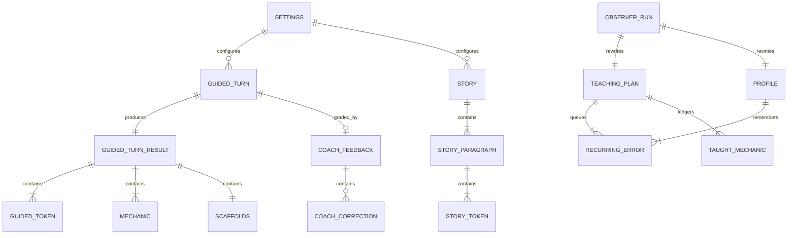

# Ontology — the domain model, nailed down

This is the single source of truth for Glossa's data contracts as of v0.1.0.
Rust types live in `commands.rs`, `observer.rs`, `settings.rs`; TypeScript
mirrors live in `src/types.ts`. Where the two have drifted, it is called out
inline — **Rust is always the authority.** **Convention: wire format is snake_case JSON
(serde). The frontend mirrors it verbatim — no translation layer.**

Entity map:

---

## 1. Settings (persisted: `settings.json`)

Owned by: user, via Settings modal. Loaded at startup; cloned per command call.

| Field | Type | Default | Semantics |
|---|---|---|---|
| `openrouter_key` | string | `""` | Required for all chat. Plaintext on disk (PoC tradeoff). **Never leaves the Rust core unmasked** — `get_settings` returns `head6••••••••tail6`, and an unchanged mask round-tripping through `save_settings` means "keep the stored key". |
| `groq_key` | string | `""` | Required only for voice input. Same masking. |
| `openrouter_model` | string | `google/gemini-2.5-flash` | Worker model (reply + analysis + coach + stories). Chosen via live bench (6/6 structured calls, zero retries). Demoted candidates auto-migrate — see `LEGACY_DEFAULT_MODELS`. |
| `observer_model` | Option\<string\> | `None` → `z-ai/glm-5.3-flash` | The reasoning model for observer passes. Editable in Settings. |
| `target_language` | string (BCP-47) | `"es-ES"` | One of the 4 codes in `languages.rs`: `en-US`, `fr-FR`, `es-ES`, `ar`. |
| `target_dialect` | string | `""` | Regional variant id from the target's `dialects` list (e.g. `es-MX`, `ar-LE`), or free text. Injected into every prompt via `overlay()`. Empty = language default. |
| `native_language` | string (ISO 639-1) | `"en"` | One of the same 4 languages' `base` codes: `en`, `fr`, `es`, `ar`. Also drives the UI chrome language (`lib/i18n.ts`). |
| `microphone_device_id` | Option\<string\> | `None` | `MediaDeviceInfo.deviceId`; `None` = system default. |
| `auto_speak` | bool | `false` | Speak each tutor reply via the configured TTS engine. |
| `auto_send` | bool | `false` | Send speech transcriptions immediately instead of filling the composer. |
| `always_romanize` | bool | `false` | Always show romanization under non-Latin tokens, not only when revealed. |
| `tts_engine` | string | `"cloud"` | `cloud` (OpenRouter gpt-audio-mini) or `os` (Web Speech, offline). Cloud failures fall back to OS voice — loudly logged. Legacy `"groq"` migrates to `"cloud"` (playai-tts decommissioned). |
| `tts_voice` | string | `"nova"` | Cloud voice name (OpenAI audio voices: alloy, nova, shimmer, …). Legacy `"Celeste-PlayAI"` migrates. |
| `shortcuts` | Shortcuts | ctrl+m / ctrl+l / ctrl+b / ctrl+, | Configurable combos: mic toggle, speak last reply, analysis panel, settings. Normalized "ctrl+shift+x" strings (`lib/keyboard.ts`). |
| `prompt_overrides` | BTreeMap\<string,string\> | `{}` | Persisted and round-tripped, but **read by nothing** — the prompt registry it was built for does not exist. See [Architecture](./architecture#prompt-registry-user-editable-prompts). |

**Rust↔TS drift:** `src/types.ts::Settings` omits `prompt_overrides`. It
survives a UI round-trip anyway (the JS object carries the unknown key
through the object spread), but the type is a lie and a future
`{...pick(settings)}` would silently wipe it.

**Languages.** `languages.rs::LANGUAGES` is the single registry and every
entry is **symmetric** — usable as target *or* native, all pairs supported by
construction. Current rungs: `en-US`, `fr-FR`, `es-ES`, `ar` (see
[Future Work](./future-work) for the ladder that gates each new one). Each
carries `direction` (ltr/rtl), `romanization` (ALA-LC for Arabic), a prompt
`overlay()` with a `{dialect}` placeholder, and a dialect list. `iso639()`
strips the region for STT.

**Single-sourced.** The frontend keeps no language table: `main.tsx` awaits
`loadLanguages()` (the `get_languages` command) before the first render, and
every picker renders from that. The pickers show `endonym`; prompts use
`name`.

**Dialects are free-form.** `target_dialect` is whatever string the learner
chose or typed — `DialectField` is a preset dropdown *plus* a free-text box.
`overlay()` resolves a known preset id to its label and passes anything else
through verbatim, so "Andaluz" steers the prompt exactly like `es-MX`. Only
an empty string means "no dialect".

---

## 2. Conversation turn

A **Turn** is one exchange: learner message (or greeting) + tutor reply +
derived analysis. Frontend-only composite (`GuidedPage.Turn`):

| Field | Type | Semantics |
|---|---|---|
| `id` | number | Monotonic per session |
| `user` | string \| null | `null` for the auto-greeting turn |
| `assistant` | GuidedTurnResult \| null | Filled at `reply_done`, replaced at `analysis_done` |
| `pendingText` | string | Streaming buffer until `reply_done` |
| `analysisState` | `pending \| done \| failed \| null` | null = no reply yet |

**History** (sent upstream): last 30 `{role, content}` pairs from completed
turns, user first. Roles: `user` / `assistant`.

---

## 3. GuidedTurnResult (the per-turn payload)

| Field | Type | Producer | Semantics |
|---|---|---|---|
| `reply` | string | Reply worker | Plain conversational target-language text. Sanitized: fence-stripped, truncated at leaked translation markers (`\n---`, `\n***`, `\n**English`, `\n**Traducción`). |
| `translation` | string \| null | Translation worker | Natural native-language translation of the reply. Revealed per sentence by tapping punctuation tokens, and shown whole in the Analysis tab. |
| `tokens` | GuidedToken[] | Tokens worker | Full reply, word by word, in order, punctuation attached. Empty = UI falls back to raw reply. |
| `user_tokens` | GuidedToken[] | Learner-tokens worker | The **learner's own message**, tokenized and glossed the same way — interrogable in the learner bubble. |
| `user_translation` | string \| null | Learner-tokens worker | Native-language translation of the learner's message. |
| `mechanics` | Mechanic[] | Mechanics worker | 1–2 explainer cards per turn. |
| `scaffolds` | Scaffolds | Scaffolds worker | Next-turn helpers; all three lists always produced, all offered in the composer. |
| `errors` | string[] | orchestrator | Per-section failure messages, rendered as visible error boxes in the breakdown pane. |

### GuidedToken

| Field | Type | Semantics |
|---|---|---|
| `text` | string | Exact word from the reply, punctuation attached. Must be copied verbatim. |
| `gloss` | string \| null | Short native-language meaning **in context**. Null for punctuation-only tokens. |
| `pos` | string \| null | Universal POS tag: NOUN, VERB, ADJ, ADV, PRON, DET, ADP, CCONJ, SCONJ, AUX, PART, INTJ, NUM, PROPN, PUNCT. |
| `notable` | bool | Worth the learner's attention (inflection, construction, word order). **Max 3 per reply.** Highlighted in both panes. |
| `romanization` | string \| null | Transliteration in the target's `romanization` scheme (ALA-LC for Arabic). Null for Latin-script targets. Shown in the gloss popup, and inline when `always_romanize` is set. |

Validation: list non-empty **and** no token longer than 48 chars — a
sentence-length "token" means the model leaked reasoning into content instead
of splitting (observed with deepseek-v4-flash; the corrective retry then
re-asks for a word-by-word split). Failure degrades to empty tokens, and the
UI falls back to rendering the raw reply.

Rendering joins tokens with spaces unless punctuation dictates otherwise
(`lib/token-spacing.ts`: no space before `.!?,;:…»"')\]`, none after `¿¡«"(\[`).

### Mechanic (grammar explainer card)

| Field | Type | Semantics |
|---|---|---|
| `title` | string | Mechanic name. Used as anti-repetition key in `recent_mechanics`. |
| `cefr` | string \| null | e.g. "A2". |
| `body` | string | 1–2 short sentences (~25 words max each), in the native language. |
| `example` | string \| null | One worked example near the reply, native gloss after an em dash. |
| `contrast` | string \| null | One sentence: how it differs from English. |

### Scaffolds

| Field | Type | Semantics |
|---|---|---|
| `replies` | string[2] | Complete target-language sentences the learner could send (tap to send). |
| `frames` | string[2] | Fill-in-the-blank sentences, `___` marks the gap (tap to fill the composer). |
| `starters` | string[2] | 2–4-word openers (tap to prepend). |

Validation: all three lists must be non-empty (else corrective retry → section
failure). **Open question:** the prompt says "exactly 2" per list but only
non-emptiness is enforced. Also produced standalone by the `generate_scaffolds`
command after a steering change.

---

## 4. TeachingPlan (persisted: `plan.json`)

**The session-level steering document.** Maintained exclusively by the
observer (full replacement each pass); rendered for the learner in the Plan
drawer; compiled into `directives_block` for the workers. Advisory only — an
empty plan is a valid plan.

| Field | Type | Default (first session) | Semantics |
|---|---|---|---|
| `session_focus` | string[1–3] | greetings/simple present; survival phrases | What to steer toward **right now**. |
| `recurring_errors` | RecurringError[] | [] | The recast queue. |
| `vocab_recycle` | string[] | [] | Vocabulary worth weaving into upcoming replies. |
| `avoid` | string[] | past tenses; long tutor turns | Overload guard. |
| `learner_interests` | string[] | [] | Conversation fuel worth asking about. |
| `energy_read` | string | "First session — warming up" | One-phrase read of learner energy. |
| `correction_budget` | u32 | 1 | Max recasts per reply (1–2 intended). |
| `taught_ledger` | TaughtMechanic[] | [] | Mechanics already covered — workers must not re-teach. |

### RecurringError

| Field | Type | Semantics |
|---|---|---|
| `error` | string | The learner's actual erroneous phrasing (verbatim). |
| `correction` | string | The correct target-language form. |
| `seen_count` | u32 | Times observed (drives recast priority). |

### TaughtMechanic

| Field | Type | Semantics |
|---|---|---|
| `mechanic` | string | Card title. |
| `last_seen_turn` | u32 | Turn index when covered. |

**Anti-repetition pipeline:** `taught_ledger` ∪ `recent_mechanics` (last 20
card titles fired by analysis workers) → "ALREADY TAUGHT (do NOT re-teach…)"
line in reply/mechanics/scaffolds prompts.

---

## 5. Profile (persisted: `profile.json`)

**Cross-session durable knowledge about the learner.** Observer-rewritten,
learner-visible. Exists so the tutor remembers you across restarts even
though the chat itself does not persist.

| Field | Type | Semantics |
|---|---|---|
| `about` | string | 2–3 sentences: who the learner is, where they are. |
| `level_notes` | string | CEFR-ish level read **with evidence**. |
| `strengths` / `weaknesses` | string[] | Observed abilities / struggles. |
| `interests` | string[] | Durable interests (distinct from the plan's session-level ones). |
| `long_term_errors` | RecurringError[] | Error history worth watching across sessions. |
| `sessions` | u32 | Sessions completed. **Note: nothing increments this in code** — the observer model would have to do it from the transcript; the prompt never asks. Currently always 0 in practice. |

---

## 6. Story (ephemeral + localStorage cache)

| Field | Type | Semantics |
|---|---|---|
| `title` | string | In the target language. |
| `paragraphs` | StoryParagraph[1–4] | In order. |

StoryParagraph = `{ tokens: StoryToken[] }`;
StoryToken = `{ text: string, gloss: string | null }` (no POS, no `notable`).

**Levels:** `beginner` (A1–A2, 40–70 words, present tense) · `intermediate`
(B1–B2, 80–130 words, common past/future) · `advanced` (C1–C2, 140–200
words, idiomatic). `resolve_cefr` maps them to A2/B1/C1 for the persona.
Validation: at least some tokens must carry glosses. Cached per
`glossa_story_<target>_<level>` in localStorage; restored on mount
(beginner only).

---

## 6.5 Agents and Runs

The AI vocabulary is **part of the domain model**, not an implementation
detail beside it.

By the OpenAI Agents SDK test — *instructions plus tools it can invoke* —
Glossa has exactly **two agents**: **Chat** and **Coach**. Everything else is
a **tool** (one transformation, no memory: `tokenize`, `translate`,
`tokenize_learner`, `explain`, `suggest`, `word_insight`, `story`) or a
**faculty** (perception/action: `transcribe`, `synthesize`). The orchestrator
is a **Runner** — deterministic Rust, not an agent.

Every execution of an operation is a **Run**; the routing between them is
declared as a **graph** (nodes, edges, shared state) in `graph.rs`, which the
Runner executes and the UI renders. `Operation.mechanical` marks the four
operations a dictionary will replace — the proof they were never agents.

Implemented in `src-tauri/src/ontology.rs`, `graph.rs` and `trace.rs`;
mirrored in `src/types.ts`. Field-by-field contract:
[Observability](./observability).

---

## 7. Cross-cutting enums

| Concept | Values |
|---|---|
| Steer level (guided chat) | `zero` → PRE-A1 · `beginner` → A2 · `intermediate` → B1 · `advanced` → C1. Chosen in the steer row (`hooks/useSteering.ts`), mapped to CEFR in `commands.rs::guided_turn`, persisted in `localStorage.glossa_level`. |
| `Level` (stories) | beginner · intermediate · advanced |
| `AnalysisState` | pending · done · failed |
| Topic steering | 16 presets + free text, `localStorage.glossa_topic` |

There is **no assist-level enum** — the 0–3 assist dial was removed. Help is
revealed per token / per sentence in the bubbles instead (see
[Overview](./overview#help-is-on-demand-not-dialed)).

---

## 8. Ownership & lifecycle summary

| Entity | Created | Mutated | Destroyed | Visible to learner? |
|---|---|---|---|---|
| Settings | first launch | Settings modal | never | keys masked |
| Turn / analysis | every guided turn | reply→analysis progression | on app exit (not persisted) | yes |
| TeachingPlan | first observer pass | observer (full replacement) | never | yes (Plan drawer) |
| Profile | default at first launch | observer (full replacement) | never | yes (Plan drawer) |
| recent_mechanics | per analysis | ring buffer push, cap 20 | on app exit | indirectly |
| Story | on generate | never | cache eviction | yes |
| Coach thread | first `coach_ask` | append (40-message cap) | `coach_thread_clear`, archived on language switch | yes (Coach tab) |

## 9. Ontology gaps & open questions (for the roadmap discussion)

1. **No persisted conversation.** Plan/Profile survive restarts; the chat
   doesn't. Is conversation history the missing "session" entity?
2. **`Profile.sessions` is unimplemented** (nothing increments it).
3. **No explicit CEFR model.** Guided chat hard-codes A2; stories use a
   3-band mapping. Where does the learner's level actually live? (Today:
   implicit, inside `Profile.level_notes` prose.)
4. **No vocabulary entity.** Glosses are per-turn ephemera; `vocab_recycle`
   is freeform strings. If we ever want SRS, tokens/glosses need to become
   first-class, persisted vocabulary items with an id.
5. **Mechanics have no stable identity.** `title` strings are the dedup key
   for anti-repetition; two phrasings of the same mechanic will both teach.
   A canonical mechanic taxonomy (id + aliases) is a candidate.
6. **One target language per install.** Settings is global. A language
   switch archives plan/profile/coach-thread to timestamped `.bak` files and
   starts clean, which is safe but one-way: there is no instant switch-back
   to a previous pairing. Story caches *are* namespaced
   (`glossa_story_<lang>_<level>`) but restore only ever reads the
   `beginner` slot.
7. **`prompt_overrides` is dead.** The field persists; no builder reads it
   and no UI writes it. Wire the registry or delete the field.
8. **No vocabulary or session entity** — see gaps 1 and 4; the analysis
   layer is still per-turn ephemera with nothing accumulating across turns.
