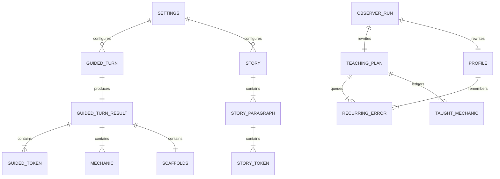

# Ontology — the domain model, nailed down

This is the single source of truth for Glossa's data contracts as of v0.1.0.
Rust types live in `commands.rs`, `observer.rs`, `settings.rs`; TypeScript
mirrors live in `src/types.ts`. **Convention: wire format is snake_case JSON
(serde). The frontend mirrors it verbatim — no translation layer.**

Entity map:

---

## 1. Settings (persisted: `settings.json`)

Owned by: user, via Settings modal. Loaded at startup; cloned per command call.

| Field | Type | Default | Semantics |
|---|---|---|---|
| `openrouter_key` | string | `""` | Required for all chat. Plaintext on disk (PoC tradeoff). |
| `groq_key` | string | `""` | Required only for voice input. |
| `openrouter_model` | string | `deepseek/deepseek-v4-flash-0731` | Worker model (reply + analysis + stories). |
| `observer_model` | Option\<string\> | `None` → `z-ai/glm-5.3-flash` | The reasoning model for observer passes. Not yet editable in UI. **Missing from the TS type** — saving Settings from the UI silently resets it. |
| `target_language` | string (BCP-47) | `"es-ES"` | One of 10 codes in `languages.rs`. |
| `native_language` | string (ISO 639-1) | `"en"` | One of 9 codes. |
| `microphone_device_id` | Option\<string\> | `None` | `MediaDeviceInfo.deviceId`; `None` = system default. |

**Languages.** Targets: `en-GB, en-US, es-ES, fr-FR, it-IT, pt-PT, de-DE,
ja-JP, ko-KR, zh-CN`. Natives: `en, es, fr, it, pt, de, ja, ko, zh`.
Each target has a hard-coded prompt `overlay()` (variant-specific guidance).
`iso639()` strips the region for STT.

---

## 2. Conversation turn

A **Turn** is one exchange: learner message (or greeting) + tutor reply +
derived analysis. Frontend-only composite (`GuidedPage.Turn`):

| Field | Type | Semantics |
|---|---|---|
| `id` | number | Monotonic per session |
| `user` | string \| null | `null` for the auto-greeting turn |
| `assistant` | GuidedTurnResult \| null | Filled at `reply_done`, replaced at `analysis_done` |
| `pendingText` | string | Streaming buffer until `reply_done` |
| `analysisState` | `pending \| done \| failed \| null` | null = no reply yet |

**History** (sent upstream): last 30 `{role, content}` pairs from completed
turns, user first. Roles: `user` / `assistant`.

---

## 3. GuidedTurnResult (the per-turn payload)

| Field | Type | Producer | Semantics |
|---|---|---|---|
| `reply` | string | Reply worker | Plain conversational target-language text. Sanitized: fence-stripped, truncated at leaked translation markers (`\n---`, `\n***`, `\n**English`, `\n**Traducción`). |
| `translation` | string \| null | Translation worker | Natural native-language translation of the reply. Rendered in-pane at assist 3, in breakdown below assist 3. |
| `tokens` | GuidedToken[] | Tokens worker | Full reply, word by word, in order, punctuation attached. Empty = UI falls back to raw reply. |
| `features` | string[] | — | **Vestigial** (always `[]`, Habla·ES leftover). Rendered as "Grammar spotted" `key=value` chips when non-empty. |
| `mechanics` | Mechanic[] | Mechanics worker | 1–2 explainer cards per turn. |
| `scaffolds` | Scaffolds | Scaffolds worker | Next-turn helpers; all three lists always produced, UI shows per assist level. |

### GuidedToken

| Field | Type | Semantics |
|---|---|---|
| `text` | string | Exact word from the reply, punctuation attached. Must be copied verbatim. |
| `gloss` | string \| null | Short native-language meaning **in context**. Null for punctuation-only tokens. |
| `pos` | string \| null | Universal POS tag: NOUN, VERB, ADJ, ADV, PRON, DET, ADP, CCONJ, SCONJ, AUX, PART, INTJ, NUM, PROPN, PUNCT. |
| `notable` | bool | Worth the learner's attention (inflection, construction, word order). **Max 3 per reply.** Highlighted in both panes. |

Rendering joins tokens with spaces unless punctuation dictates otherwise
(`lib/token-spacing.ts`: no space before `.!?,;:…»"')\]`, none after `¿¡«"(\[`).

### Mechanic (grammar explainer card)

| Field | Type | Semantics |
|---|---|---|
| `title` | string | Mechanic name. Used as anti-repetition key in `recent_mechanics`. |
| `cefr` | string \| null | e.g. "A2". |
| `body` | string | 1–2 short sentences (~25 words max each), in the native language. |
| `example` | string \| null | One worked example near the reply, native gloss after an em dash. |
| `contrast` | string \| null | One sentence: how it differs from English. |

### Scaffolds

| Field | Type | Semantics |
|---|---|---|
| `replies` | string[2] | Complete target-language sentences the learner could send (assist 3: tap-to-send). |
| `frames` | string[2] | Fill-in-the-blank sentences, `___` marks the gap (assist 2: tap to fill composer). |
| `starters` | string[2] | 2–4-word openers (assist 1: tap to prepend). |

Validation: all three lists must be non-empty (else corrective retry → section
failure). **Open question:** the prompt says "exactly 2" per list but only
non-emptiness is enforced.

---

## 4. TeachingPlan (persisted: `plan.json`)

**The session-level steering document.** Maintained exclusively by the
observer (full replacement each pass); rendered for the learner in the Plan
drawer; compiled into `directives_block` for the workers. Advisory only — an
empty plan is a valid plan.

| Field | Type | Default (first session) | Semantics |
|---|---|---|---|
| `session_focus` | string[1–3] | greetings/simple present; survival phrases | What to steer toward **right now**. |
| `recurring_errors` | RecurringError[] | [] | The recast queue. |
| `vocab_recycle` | string[] | [] | Vocabulary worth weaving into upcoming replies. |
| `avoid` | string[] | past tenses; long tutor turns | Overload guard. |
| `learner_interests` | string[] | [] | Conversation fuel worth asking about. |
| `energy_read` | string | "First session — warming up" | One-phrase read of learner energy. |
| `correction_budget` | u32 | 1 | Max recasts per reply (1–2 intended). |
| `taught_ledger` | TaughtMechanic[] | [] | Mechanics already covered — workers must not re-teach. |

### RecurringError

| Field | Type | Semantics |
|---|---|---|
| `error` | string | The learner's actual erroneous phrasing (verbatim). |
| `correction` | string | The correct target-language form. |
| `seen_count` | u32 | Times observed (drives recast priority). |

### TaughtMechanic

| Field | Type | Semantics |
|---|---|---|
| `mechanic` | string | Card title. |
| `last_seen_turn` | u32 | Turn index when covered. |

**Anti-repetition pipeline:** `taught_ledger` ∪ `recent_mechanics` (last 20
card titles fired by analysis workers) → "ALREADY TAUGHT (do NOT re-teach…)"
line in reply/mechanics/scaffolds prompts.

---

## 5. Profile (persisted: `profile.json`)

**Cross-session durable knowledge about the learner.** Observer-rewritten,
learner-visible. Exists so the tutor remembers you across restarts even
though the chat itself does not persist.

| Field | Type | Semantics |
|---|---|---|
| `about` | string | 2–3 sentences: who the learner is, where they are. |
| `level_notes` | string | CEFR-ish level read **with evidence**. |
| `strengths` / `weaknesses` | string[] | Observed abilities / struggles. |
| `interests` | string[] | Durable interests (distinct from the plan's session-level ones). |
| `long_term_errors` | RecurringError[] | Error history worth watching across sessions. |
| `sessions` | u32 | Sessions completed. **Note: nothing increments this in code** — the observer model would have to do it from the transcript; the prompt never asks. Currently always 0 in practice. |

---

## 6. Story (ephemeral + localStorage cache)

| Field | Type | Semantics |
|---|---|---|
| `title` | string | In the target language. |
| `paragraphs` | StoryParagraph[1–4] | In order. |

StoryParagraph = `{ tokens: StoryToken[] }`;
StoryToken = `{ text: string, gloss: string | null }` (no POS, no `notable`).

**Levels:** `beginner` (A1–A2, 40–70 words, present tense) · `intermediate`
(B1–B2, 80–130 words, common past/future) · `advanced` (C1–C2, 140–200
words, idiomatic). `resolve_cefr` maps them to A2/B1/C1 for the persona.
Validation: at least some tokens must carry glosses. Cached per
`glossa_story_<target>_<level>` in localStorage; restored on mount
(beginner only).

---

## 7. Cross-cutting enums

| Concept | Values |
|---|---|
| `AssistLevel` | 0 Immersion · 1 Light · 2 Guided · 3 Full support |
| `Level` (stories) | beginner · intermediate · advanced |
| `AnalysisState` | pending · done · failed |
| CEFR (guided chat) | **hard-coded "A2"** pending an onboarding picker (commands.rs:195) |

---

## 8. Ownership & lifecycle summary

| Entity | Created | Mutated | Destroyed | Visible to learner? |
|---|---|---|---|---|
| Settings | first launch | Settings modal | never | keys masked |
| Turn / analysis | every guided turn | reply→analysis progression | on app exit (not persisted) | yes |
| TeachingPlan | first observer pass | observer (full replacement) | never | yes (Plan drawer) |
| Profile | default at first launch | observer (full replacement) | never | yes (Plan drawer) |
| recent_mechanics | per analysis | ring buffer push, cap 20 | on app exit | indirectly |
| Story | on generate | never | cache eviction | yes |

## 9. Ontology gaps & open questions (for the roadmap discussion)

1. **No persisted conversation.** Plan/Profile survive restarts; the chat
   doesn't. Is conversation history the missing "session" entity?
2. **`Profile.sessions` is unimplemented** (nothing increments it).
3. **No explicit CEFR model.** Guided chat hard-codes A2; stories use a
   3-band mapping. Where does the learner's level actually live? (Today:
   implicit, inside `Profile.level_notes` prose.)
4. **No vocabulary entity.** Glosses are per-turn ephemera; `vocab_recycle`
   is freeform strings. If we ever want SRS, tokens/glosses need to become
   first-class, persisted vocabulary items with an id.
5. **Mechanics have no stable identity.** `title` strings are the dedup key
   for anti-repetition; two phrasings of the same mechanic will both teach.
   A canonical mechanic taxonomy (id + aliases) is a candidate.
6. **`features` is dead.** Either wire it (Habla·ES-style `key=value` chips)
   or delete it from the contract.
7. **One target language per install.** Settings is global; plan/profile/
   story caches are not namespaced by language. Switching target language
   mid-life will mix documents written for different languages.
8. **`observer_model` missing from TS Settings** — silent reset on UI save
   (see [Status](./status)).
